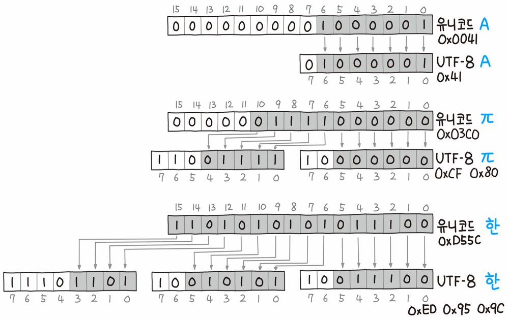

# Golang 문자열

### DEFAULT

Golang은 가변 길이 유니코드 인코딩 **UTF-8**을 default로 사용한다.

```go
package main

import "fmt"

func main() {
	poet1 := "죽는 날까지 하늘을 우러러\n한 점 부끄럼이 없기를,\n잎새에 이는 바람에도\n나는 괴로워했다.\n"

	poet2 := `죽는 날까지 하늘을 우러러
한 점 부끄럼이 없기를,
잎새에 이는 바람에도
나는 괴로워했다.
`

	fmt.Println(poet1)
	fmt.Println(poet2)
}
```

### UTF-8

자주 사용되는 영문과 숫자는 1byte로 표기하고, 비교적 덜 사용되는 ASCII 문자 이외의 문자들은 byte를 더 소모해서 표기하는 방식이다. 유연하기 때문에 공간 절약이 가능하다.



ASCII 코드에 대응되는 문자들의 경우는 첫 bit가 0이다.

만일 표기되는데 2bytes 이상이 필요한 문자들의 첫 bit는 1로 시작한다.

### string은 []byte 타입

```go
package main

import "fmt"

func main() {
	str := "Hello 월드"

	for i := 0; i < len(str); i++ {
		fmt.Printf("타입:%T 값:%d 문자값:%c\n", str[i], str[i], str[i])
	}
}
```

```go
타입:uint8 값:72 문자값:H
타입:uint8 값:101 문자값:e
타입:uint8 값:108 문자값:l
타입:uint8 값:108 문자값:l
타입:uint8 값:111 문자값:o
타입:uint8 값:32 문자값:
타입:uint8 값:236 문자값:ì
타입:uint8 값:155 문자값:›
타입:uint8 값:148 문자값:”
타입:uint8 값:235 문자값:ë
타입:uint8 값:147 문자값:“
타입:uint8 값:156 문자값:œ
```

영문자들의 경우 한 문자가 1byte로 표기되지만, 한글은 한 문자가 3bytes로 표기되기 때문에 엉뚱한 값이 출력된다.

문자 단위로 순회할 순 없을까?

### Rune

```go
package main

import "fmt"

func main() {
	str := "Hello 월드"
	runeStr := []rune(str)

	for i := 0; i < len(runeStr); i++ {
		fmt.Printf("타입:%T 값:%d 문자값:%c\n", runeStr[i], runeStr[i], runeStr[i])
	}
}
```

```go
타입:int32 값:72 문자값:H
타입:int32 값:101 문자값:e
타입:int32 값:108 문자값:l
타입:int32 값:108 문자값:l
타입:int32 값:111 문자값:o
타입:int32 값:32 문자값:
타입:int32 값:50900 문자값:월
타입:int32 값:46300 문자값:드
```

rune타입은 int32타입의 별칭이다.

### Range를 사용해 순회하기

```go
package main

import "fmt"

func main() {
	str := "Hello 월드"

	for _, v := range str {
		fmt.Printf("타입:%T 값:%d 문자값:%c\n", v, v, v)
	}
}
```

```go
타입:int32 값:72 문자값:H
타입:int32 값:101 문자값:e
타입:int32 값:108 문자값:l
타입:int32 값:108 문자값:l
타입:int32 값:111 문자값:o
타입:int32 값:32 문자값:
타입:int32 값:50900 문자값:월
타입:int32 값:46300 문자값:드
```

### 연산자 +

```go
package main

import "fmt"

func main() {
	str1 := "Hello" + " " + "world"
	fmt.Println(str1)
	str2 := "I like number " + 2
	fmt.Println(str2)
}
```

```go
invalid operation: "I like number " + 2 (mismatched types untyped string and untyped int)
```

Golang은 자동으로 타입 변환을 해주는 경우가 거의 없다.

### 문자열 비교

```go
package main

import "fmt"

func main() {
	fmt.Println("Hello" == "Hello")
	fmt.Println("Hello" > "Hallo")
	fmt.Println("H" > "h")
}
```

```go
true
true
false
```

**==** 연산자는 두 문자열의 내용물이 동일한지 비교한다.

**<** 혹은 **>** 연산자는 사전 순서를 기준으로 비교한다.

### 문자열 구조

```go
type StringHeader struct {
	Data uintptr
	Len  int
}
```

```go
package main

import (
	"fmt"
	"reflect"
	"unsafe"
)

func main() {
	str1 := "Hello 월드"
	str2 := str1

	stringHeader1 := (*reflect.StringHeader)(unsafe.Pointer(&str1))
	stringHeader2 := (*reflect.StringHeader)(unsafe.Pointer(&str2))

	fmt.Println(stringHeader1)
	fmt.Println(stringHeader2)
}
```

```go
&{4818953 12}
&{4818953 12}
```

### 문자열은 불변이다

```go
package main

import "fmt"

func main() {
	str := "Hello 월드"
	str[2] = 97

	fmt.Println(str)
}
```

```go
cannot assign to str[2] (value of type byte)
```

문자열 데이터 자체가 불변이기 때문에 쓰기가 불가능하다.

또한, 타입 변환 시에도 새로운 데이터가 생성된다. 문자열 자체를 하나의 상수라고 볼 수 있다.

```go
package main

import "fmt"

func main() {
	str1 := "Hello 월드"
	str2 := []byte(str1)

	str2[2] = 'a'

	fmt.Println(str1)
	fmt.Println(string(str2))
}
```

```go
Hello 월드
Healo 월드
```

문자열 합산(+) 시에도 새로운 공간에 새로운 데이터를 할당한다.

따라서, 보다 효율적인 연산을 위해 내부적으로 슬라이스 타입을 사용하는 **strings 패키지의 Builder**를 사용하는 것이 좋다.

```go
package main

import (
	"fmt"
	"strings"
)

func ToUpper(s string) string {
	var builder strings.Builder
	for _, v := range s {
		if v >= 'a' && v <= 'z' {
			builder.WriteRune('A' + (v - 'a'))
		} else {
			builder.WriteRune(v)
		}
	}
	return builder.String()
}

func main() {
	fmt.Println(ToUpper("Hello world"))
}
```

### 왜 불변…?

안정성을 위해서다. 여러 인스턴스에 의해 공유되고 있는 데이터의 **일관성을 보장**하기 위해서이다.
